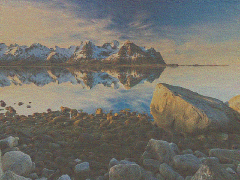
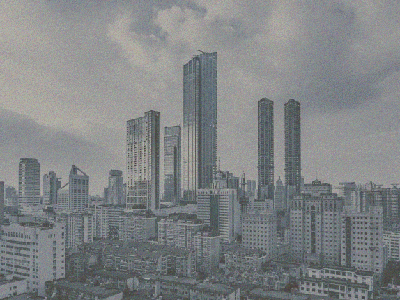
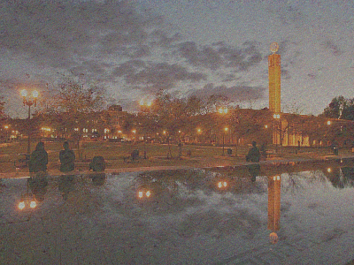

# Neural Style Transfer #
Neural style transfer is an algorithm that takes two images and generates an image with the content 
of one image with the style of the other. The techniques can be found in [Leon A. Gatys, Alexander S. Ecker, and 
Matthias Bethge 's "A Neural Algorithm of Artistic Style"](https://arxiv.org/pdf/1508.06576.pdf).  
My implementation uses intermediate layers of [Keras' pre-trained VGG-19 model](https://keras.io/applications/#vgg19).
While the content cost is computed using the activation of layer 3, the weighted style cost is computed using the 
activations of layers 2, 3, 4 with weights (0.3, 0.4, 0.3). Optimization is done using scipy's L-BFGS implementation.   
## Examples: ## 
- Nature + The Scream:  
 
- Building + Starry Night:  

- Campus + Starry Night:  

